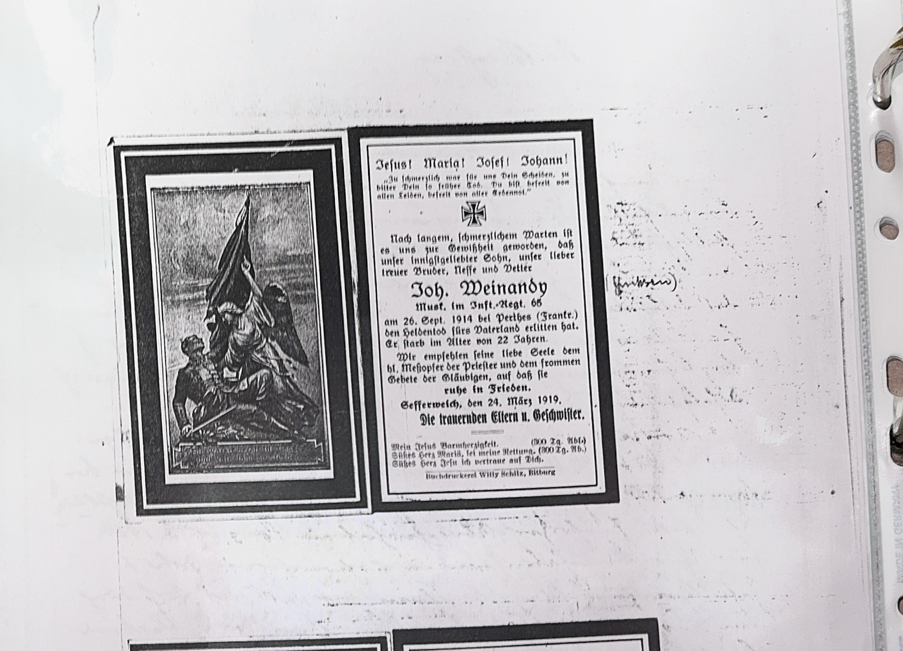
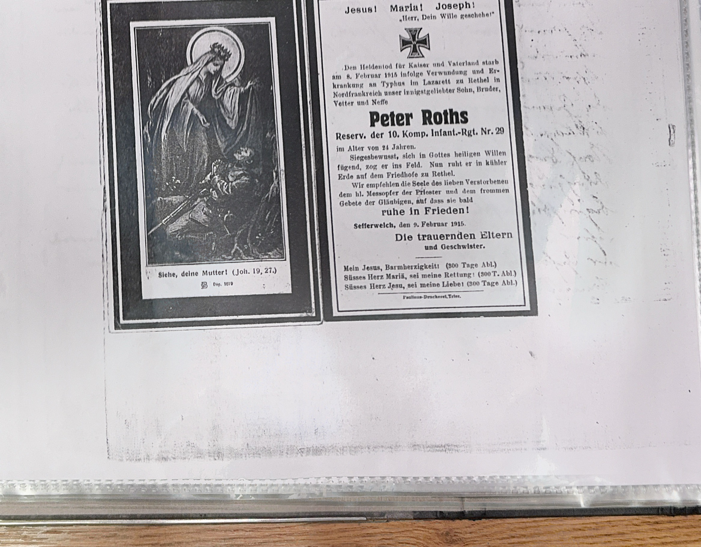

### Hinweise zur Transkription:
- **Kein Fließtext:** Diese Seite enthält zwei eingeklebte Totenzettel (Sterbebilder) für im Ersten Weltkrieg gefallene Soldaten aus Sefferweich. — [Wikipedia: Sterbebild](https://de.wikipedia.org/wiki/Sterbebild)
- **Joh. Weinandy:** Gefallen am 26. September 1914 bei Perthes (Frankreich), 22 Jahre alt. Perthes-lès-Hurlus war Schauplatz schwerer Kämpfe in der Champagne. — [Wikipedia: Herbstschlacht in der Champagne](https://de.wikipedia.org/wiki/Herbstschlacht_in_der_Champagne)
- **Peter Roths:** Reservist der 10. Komp., Infant.-Rgt. Nr. 29. Gestorben am 6. Februar 1915 an Verwundung und Typhus im Lazarett, 21 Jahre alt. — [Wikipedia: Typhus](https://de.wikipedia.org/wiki/Typhus)
- **Eisernes Kreuz:** Auf dem Totenzettel von Peter Roths abgebildet. — [Wikipedia: Eisernes Kreuz](https://de.wikipedia.org/wiki/Eisernes_Kreuz)

#### Totenzettel 1 — Joh. Weinandy



```text
                        Jesus! Maria! Josef! Johann!

                        Nach langem, schmerzlichem Warten ist
                        es uns zur Gewißheit geworden, daß
                        unser innigstgeliebter Sohn, unser lieber Bruder, Neffe und Vetter

                                    Joh. Weinandy
                        Musket. Inf.-Rgt. 66
                        am 26. Sept. 1914 bei Perthes (Frankr.)
                        den Heldentod fürs Vaterland erlitten hat.
                        Er starb im Alter von 22 Jahren.

                        Wir empfehlen seine liebe Seele dem
                        hl. Meßopfer der Priester und dem frommen
                        Gebete der Gläubigen, auf daß sie
                                ruhe in Frieden.
                        Sefferweich, den 24. März 1919.
                        Die trauernden Eltern u. Geschwister.
```

#### Totenzettel 2 — Peter Roths



```text
                        Jesus! Maria! Joseph!

                        Den Heldentod für Kaiser und Vaterland starb
                        am 6. Februar 1915 infolge Verwundung und Er-
                        krankung an Typhus im Lazarett zu Hasfield [?]
                        in Nordfrankreich unser innigstgeliebter Sohn, Bruder,
                        Vetter und Neffe

                                    Peter Roths
                        Reserv. der 10. Komp. Infant.-Rgt. Nr. 29
                        im Alter von 21 Jahren.

                        Sefferweich, den 8. Februar 1916.
                        Die trauernden Eltern und Geschwister.
```

***

### Historische und sprachliche Analyse:
- **Totenzettel / Sterbebilder:** Im katholischen Rheinland verbreitete Tradition: bedruckte Karten mit Gebet, Heiligenbild und Lebensdaten des Verstorbenen, die an Verwandte und Bekannte verteilt wurden.
  - *Quelle:* [Wikipedia: Sterbebild](https://de.wikipedia.org/wiki/Sterbebild)
- **Perthes (Champagne):** Perthes-lès-Hurlus war ab September 1914 Schauplatz schwerer Stellungskämpfe an der Westfront.
  - *Quelle:* [Wikipedia: Herbstschlacht in der Champagne](https://de.wikipedia.org/wiki/Herbstschlacht_in_der_Champagne)
- **Typhus im Lazarett:** Infektionskrankheiten wie Typhus waren im Ersten Weltkrieg eine häufige Todesursache neben den Kampfhandlungen.
  - *Quelle:* [Wikipedia: Typhus](https://de.wikipedia.org/wiki/Typhus)
