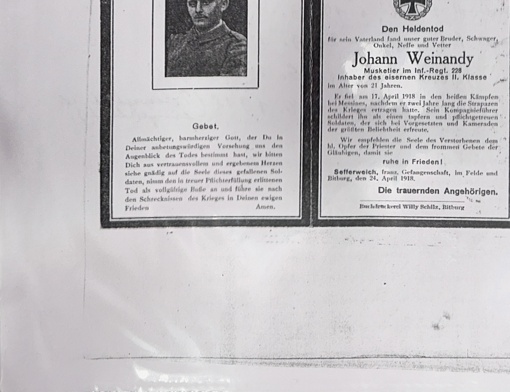

### Hinweise zur Transkription:
- **Valentin Stoffels:** Theologiestudent und Leutnant d.R., Inf.-Rgt. 97, EK II. Geboren 24.9.1891 in Sefferweich. Besuchte das Gymnasium in Prüm (s. Seite 026 — einer der zwei Jungen!), dann bischöfliches Priesterseminar. Kriegsausbruch 1914 unterbrach sein Studium. Kämpfte in Russland, verwundet, als Leutnant zurück an die Front, fiel an der Spitze seines Zuges.
- **Johann Weinandy:** Musketier im Inf.-Rgt. 228, EK II, 21 Jahre. Gefallen 17. April 1918 „bei Messines" — vermutlich die [Flandernschlacht](https://de.wikipedia.org/wiki/Vierte_Flandernschlacht). Verwandt mit dem auf Seite 031 genannten Joh. Weinandy (†1914).
- **Levitenamt:** Feierliches Hochamt mit Diakon und Subdiakon — höchste Form der kath. Totenmesse. — [Wikipedia: Levitiertes Hochamt](https://de.wikipedia.org/wiki/Levitiertes_Hochamt)
- **Buchdruckerei Willy Schilz, Bitburg:** Auf dem Weinandy-Totenzettel als Druckerei angegeben.

#### Totenzettel 1 — Valentin Stoffels


```text
        Jesus! Maria! Joseph! Valentin!         Zum frommen Andenken
                                                an unseren innigstgeliebten Sohn,
                                                Bruder, Neffen und Vetter
                                                den Theologen
                                                Valentin Stoffels
                        Leutnant der Reserve im Inf.-Rgt. 97,
                        Inhaber des Eisernen Kreuzes II. Klasse.

                        Er war geboren am 24. September 1891
                        in Sefferweich, trat nach Absolvierung des
                        Gymnasiums in Prüm zu Ostern in das
                        Bischöfliche Priesterseminar ein und wid-
                        mete sich mit heißer Liebe dem hin und [?]
                        guten Erfolge der Theologie, begann 1914
                        bruch des Krieges. Bis zum 18. Mai 1915 war er in einem nach-
                        garten Stelle [...] der Winterstellung in Rußland mit.
                        Im Felde angenommen der
                        Krankheit wieder hergestellt, kam er im
                        Herbst 1917 als Leutnant wieder ins Feld
                        und fiel an der Spitze seines Zuges von
                        tödlichen dem Bataillon schwer verwundet
                        in die Hände.

                        Das feierliche Levitenamt findet statt
                        am 14. Oktober, vormittags 10 Uhr in der
                        Kirche zu Sefferweich.
                        Sefferweich und im Felde, 10. Okt. 1918.
                        Die tieftrauernden Eltern und Geschwister.
```

#### Totenzettel 2 — Johann Weinandy



```text
                        Jesus!    Maria!    Josef!

                                    Den Heldentod
                        für sein Vaterland fand unser guter Bruder, Schwager,
                        Onkel, Neffe und Vetter

                                    Johann Weinandy
                        Musketier im Inf.-Regt. 228,
                        Inhaber des eisernen Kreuzes II. Klasse
                        im Alter von 21 Jahren.

                        Er fiel am 17. April 1918 in den heißen Kämpfen
                        bei Messines, nachdem er zwei Jahre lang die Strapazen
                        des Krieges ertragen hatte. Sein Kompanieführer
                        schildert ihn als einen tapfern und pflichtgetreuen
                        Soldaten, der sich bei Vorgesetzten und Kameraden
                        der größten Beliebtheit erfreute.

                        Sefferweich, franz. Gefangenschaft, im Felde und
                        Bitburg, den 24. April 1918.
                        Die trauernden Angehörigen.

                        Buchdruckerei Willy Schilz, Bitburg.
```

***

### Historische und sprachliche Analyse:
- **Valentin Stoffels — vom Theologiestudenten zum Leutnant:** Einer der zwei Jungen von Seite 026, die ins Gymnasium Prüm eintraten. Sein Weg (Gymnasium → Priesterseminar → Kriegsdienst → Tod) steht exemplarisch für eine verlorene Generation.
- **Messines (Mesen):** Stadt in Westflandern (Belgien), Schauplatz der Schlacht von Messines (1917) und weiterer Kämpfe 1918.
  - *Quelle:* [Wikipedia: Schlacht von Messines](https://de.wikipedia.org/wiki/Schlacht_von_Messines)
- **Familie Weinandy:** Zwei Weinandys fielen — Joh. Weinandy 1914 (S. 031) und Johann Weinandy 1918. Für eine Familie ein unvorstellbarer Verlust.
- **„franz. Gefangenschaft"** in der Herkunftszeile: Ein Angehöriger der Familie befand sich zum Zeitpunkt der Drucklegung offenbar in französischer Kriegsgefangenschaft.
