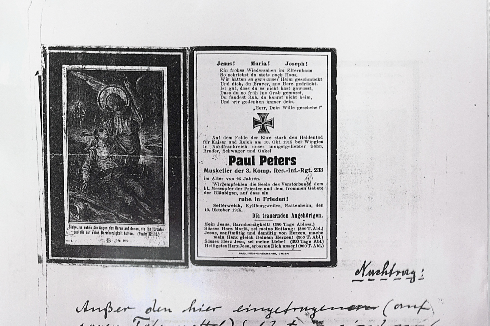

### Hinweise zur Transkription:
- **Paul Peters:** Musketier der 3. Komp. Res.-Inf.-Rgt. 233, ca. 30 Jahre alt. Gefallen am 10. Oktober 1915 bei Wingles (Pas-de-Calais), einem Brennpunkt der Westfront nahe Lens.
- **Handschriftlicher Nachtrag:** Listet vier weitere Gefallene, die keinen eigenen Totenzettel in der Chronik haben. Zusammen mit den drei Totenzetteln (S. 031–033) ergeben sich 7–8 Gefallene — passend zur Angabe auf Seite 030.
- **Wingles:** Gemeinde im Département Pas-de-Calais, nahe dem Kohlebergbaugebiet von Lens, wo 1915 schwere Stellungskämpfe stattfanden. — [Wikipedia: Lorettoschlacht](https://de.wikipedia.org/wiki/Lorettoschlacht)

#### Totenzettel — Paul Peters



```text
                        Jesus!    Maria!    Joseph!

                        Auf dem Felde der Ehre starb den Heldentod
                        für Kaiser und Reich am 10. Okt. 1915 bei Wingles
                        in Nordfrankreich unser innigstgeliebter Sohn,
                        Bruder, Schwager und Onkel

                                    Paul Peters
                        Musketier der 3. Komp. Res.-Inf.-Rgt. 233
                        im Alter von ca. 30 Jahren.

                        Wir empfehlen die Seele des Verstorbenen dem
                        hl. Meßopfer der Priester und dem frommen Gebete
                        der Gläubigen, auf dass sie
                                    ruhe in Frieden!
                        Sefferweich, Kaltenherberg, Nattenheim, den
                        10. Oktober 1915.
                        Die trauernden Angehörigen.
```

#### Handschriftlicher Nachtrag

```text
                                                Nachtrag:

                        Außer den hier eingetragenen (auf
                        sogen. Totenzettel) Soldaten sind noch
                        folgende auf Frankr. od. Rußlands
                        Schlachtfeldern begraben:

                        Leonhard Feil, † 19. 3. 1915
                        Johann Schneider, † 22. 9. 1916
                        Schmitz, † 12. 6. 1917
                        Valentin Stoffels, Lt. † 18. 6. 1918 (Totenzettel ist
                                                              eingeklebt).
```

***

### Historische und sprachliche Analyse:
- **Wingles (Pas-de-Calais):** Gemeinde im nordfranzösischen Kohlebergbaugebiet nahe Lens. Die Region war von 1914 bis 1918 Schauplatz erbitterter Stellungskämpfe, u.a. der Lorettoschlacht (Mai 1915).
  - *Quelle:* [Wikipedia: Lorettoschlacht](https://de.wikipedia.org/wiki/Lorettoschlacht)
- **Res.-Inf.-Rgt. 233:** Reserve-Infanterie-Regimenter wurden bei Kriegsbeginn 1914 aus Reservisten aufgestellt.
- **Gesamtzahl der Gefallenen:** Die Totenzettel nennen Joh. Weinandy (†1914), Peter Roths (†1915), Paul Peters (†1915), Johann Weinandy (†1918), dazu der Nachtrag: Leonhard Feil (†1915), Johann Schneider (†1916), Schmitz (†1917), Valentin Stoffels (†1918) = 8 Namen. Seite 030 nennt 7 Gefallene — möglicherweise wurde einer doppelt gezählt oder einer der Genannten stammte nicht direkt aus Sefferweich (Peters' Totenzettel nennt auch Kaltenherberg und Nattenheim).
